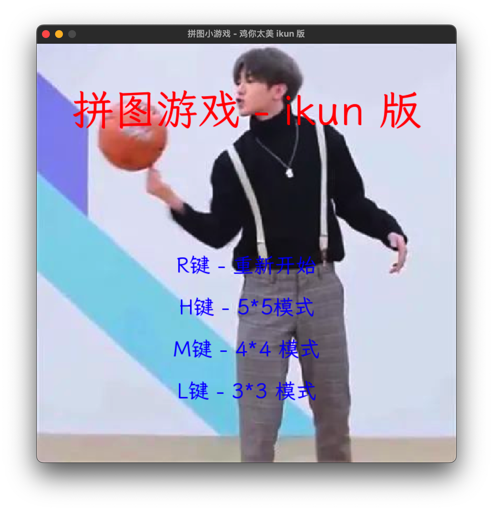
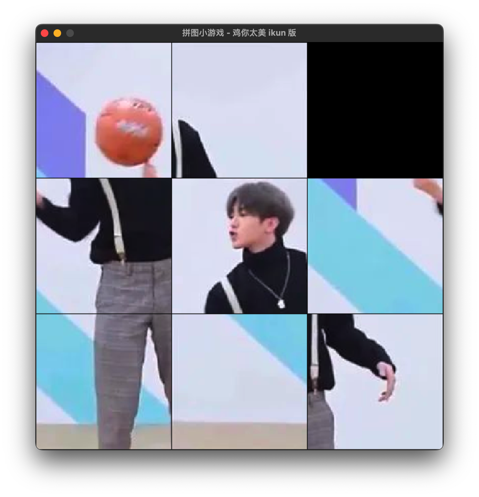

# 拼图 - 鸡你太美 ikun 版

## 安装




## 开发

mac

```bash
python3 -m venv ./venv
./venv/bin/python3 -m pip install pygame pyinstaller
# 运行
./venv/bin/python3 main.py
# 打包
./venv/bin/pyinstaller -F -w -i main.ico main.py --add-data "resources:resources" -n ikun
```

win

```cmd
python -m venv ./venv
.\venv\Scripts\python -m pip install pygame pyinstaller
# 运行
.\venv\Scripts\python main.py
# 打包
.\venv\Scripts\pyinstaller.exe -F -w -i main.ico main.py --add-data "resources;resources" -n ikun
```

## 参考

- [https://github.com/CharlesPikachu/Games](https://github.com/CharlesPikachu/Games)
- [字体 LxgwWenKai](https://github.com/lxgw/LxgwWenKai/releases/tag/v1.245.1)
